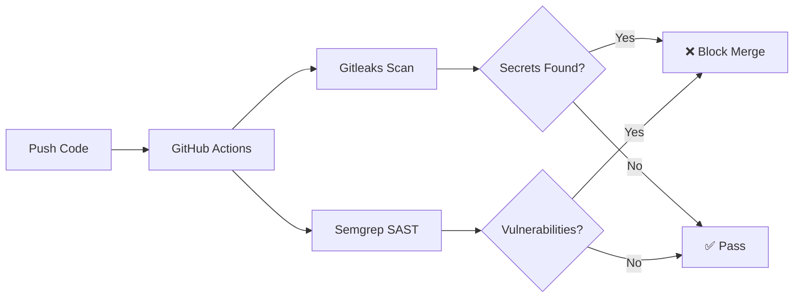

# 🛡️ Golden Pipeline - Security as Code Demo


## 🎯 Objetivo

Este repositorio demuestra la implementación de un **pipeline CI/CD seguro** utilizando GitHub Actions. El objetivo es detectar y **bloquear automáticamente** código vulnerable antes de que llegue a producción.

## 🔒 Herramientas de Seguridad Integradas

| Herramienta | Propósito | Tipo |
|-------------|-----------|------|
| **Gitleaks** | Detecta secretos y contraseñas hardcodeadas | Secret Detection |
| **Semgrep** | Análisis estático de código (SAST) | Code Analysis |

## 🚀 Flujo del Pipeline



## 📁 Estructura del Proyecto

```
Golden-Pipeline/
├── .github/
│   └── workflows/
│       └── security-pipeline.yml    # Pipeline de seguridad
├── src/
│   ├── app_vulnerable.py            # ⚠️ Código vulnerable (demo)
│   └── app_secure.py                # ✅ Código seguro (solución)
├── .gitleaks.toml                   # Configuración de Gitleaks
├── .semgrepignore                   # Exclusiones de Semgrep
└── README.md
```

## ⚠️ Vulnerabilidades Intencionadas (Demo)

El archivo `src/app_vulnerable.py` contiene vulnerabilidades **intencionadas** para demostrar el funcionamiento del pipeline:

1. **🔑 Secreto Hardcodeado**: Contraseña en texto plano
2. **💉 SQL Injection**: Query vulnerable a inyección
3. **🔓 Credenciales de API**: API key expuesta

## 🧪 Cómo Probar

### 1. Hacer push con código vulnerable
```bash
git add .
git commit -m "feat: add vulnerable code for testing"
git push origin main
```

### 2. Ver el pipeline fallar
- Ve a la pestaña **Actions** en GitHub
- Observa cómo el pipeline detecta las vulnerabilidades
- **Screenshot perfecto para tu portfolio!** 📸

### 3. Arreglar y ver el pipeline pasar
```bash
# Usa app_secure.py como referencia
git add .
git commit -m "fix: remove hardcoded secrets and SQL injection"
git push origin main
```

## 📸 Capturas para Portfolio

1. **Pipeline Fallido (Rojo)**: Actions > Security Pipeline > Ver logs de error
2. **Detección de Secretos**: Logs de Gitleaks mostrando el secreto encontrado
3. **Detección de SQLi**: Logs de Semgrep mostrando la vulnerabilidad
4. **Pipeline Exitoso (Verde)**: Después de arreglar el código

## 🏆 Skills Demostradas

- ✅ Security as Code
- ✅ CI/CD con GitHub Actions
- ✅ Análisis Estático de Código (SAST)
- ✅ Detección de Secretos
- ✅ DevSecOps Best Practices
- ✅ Shift-Left Security

## 📚 Recursos

- [Gitleaks Documentation](https://github.com/gitleaks/gitleaks)
- [Semgrep Documentation](https://semgrep.dev/docs/)
- [GitHub Actions Security](https://docs.github.com/en/actions/security-guides)

---

**Autor:** Guillermo  
**Propósito:** Portfolio de Ciberseguridad/DevSecOps  
**Licencia:** MIT
