```mermaid
graph LR
    A[Push Code] --> B[GitHub Actions]
    B --> C[Gitleaks Scan]
    B --> D[Semgrep SAST]
    C --> E{Secrets Found?}
    D --> F{Vulnerabilities?}
    E -->|Yes| G[❌ Block Merge]
    E -->|No| H[✅ Pass]
    F -->|Yes| G
    F -->|No| H
```

# 🛡️ Golden Pipeline - Security as Code Demo


## 🎯 Objective

This repository demonstrates the implementation of a **secure CI/CD pipeline** using GitHub Actions. The goal is to automatically detect and **block vulnerable code** before it reaches production.

## 🔒 Integrated Security Tools

| Tool | Purpose | Type |
|------|---------|------|
| **Gitleaks** | Detects hardcoded secrets and passwords | Secret Detection |
| **Semgrep** | Static Application Security Testing (SAST) | Code Analysis |

## 🚀 Pipeline Flow



## 📁 Project Structure

```
Golden-Pipeline/
├── .github/
│   └── workflows/
│       └── security-pipeline.yml    # Security pipeline
├── src/
│   └── app.py                       # ✅ Secure production code
├── screenshots/                     # 📸 Portfolio evidence
│   ├── 01-04: Failed pipeline
│   ├── 05-06: Detailed logs  
│   └── 07-08: Successful pipeline
├── .gitleaks.toml                   # Gitleaks configuration
├── .semgrepignore                   # Semgrep exclusions
└── README.md
```

## ⚠️ Intentional Vulnerabilities (Demo)

The original `app_vulnerable.py` file contained **intentional vulnerabilities** to demonstrate the pipeline's detection capabilities:

1. **🔑 Hardcoded Secrets**: Plain text passwords and API keys
2. **💉 SQL Injection**: Vulnerable database queries
3. **⚠️ Insecure eval()**: Arbitrary code execution risk
4. **🔓 Disabled SSL**: Man-in-the-middle attack vulnerability

## 🧪 How to Test

### 1. Push vulnerable code
```bash
git add .
git commit -m "feat: add vulnerable code for testing"
git push origin main
```

### 2. Watch the pipeline fail
- Go to the **Actions** tab on GitHub
- Observe how the pipeline detects vulnerabilities
- **Perfect screenshot for your portfolio!** 📸

### 3. Fix and watch the pipeline pass
```bash
git add .
git commit -m "fix: remove hardcoded secrets and SQL injection"
git push origin main
```

## 📸 Pipeline in Action - Screenshots

### ❌ CASE 1: Pipeline Detects Vulnerabilities (FAILED)

#### 1.1 Overview - Pipeline Blocked

*Workflow shows FAILED status (red) when detecting vulnerable code*

#### 1.2 Gitleaks - Secret Detection

*Gitleaks detects hardcoded passwords and API keys*

#### 1.3 Semgrep - SAST Analysis

*Semgrep finds SQL Injection and other vulnerabilities*

#### 1.4 Security Summary - Build Blocked

*Final summary: Build blocked due to security issues*

#### 1.5 Detailed Logs - Gitleaks (6 Secrets Found)

*Logs showing: "6 leaks found" - Passwords and API keys detected in app_vulnerable.py*

#### 1.6 Detailed Logs - Semgrep (Critical Vulnerabilities)

*JSON logs with SQL Injection, insecure eval(), and disabled SSL verification*

---

### ✅ CASE 2: Pipeline Passes After Fix (SUCCESS)

#### 2.1 Overview - All Workflows

*Perfect contrast: Fix in green ✅ vs vulnerable commits in red ❌*

#### 2.2 Details - All Jobs Passed

*Gitleaks ✅ | Semgrep ✅ | Dependency Check ✅ | Security Summary ✅*

---

## 🛡️ Vulnerabilities Detected

| Type | Tool | Status |
|------|------|--------|
| 🔑 Hardcoded passwords | Gitleaks | ✅ 6 secrets found |
| 🔑 Exposed API keys | Gitleaks | ✅ Detected |
| 💉 SQL Injection | Semgrep | ✅ Detected |
| ⚠️ Insecure eval() | Semgrep | ✅ Detected |
| 🔓 Disabled SSL | Semgrep | ✅ Detected |

## 🏆 Skills Demonstrated

- ✅ Security as Code
- ✅ CI/CD with GitHub Actions
- ✅ Static Application Security Testing (SAST)
- ✅ Secret Detection
- ✅ DevSecOps Best Practices
- ✅ Shift-Left Security
- ✅ Vulnerability Remediation

## 📚 Resources

- [Gitleaks Documentation](https://github.com/gitleaks/gitleaks)
- [Semgrep Documentation](https://semgrep.dev/docs/)
- [GitHub Actions Security](https://docs.github.com/en/actions/security-guides)
- [OWASP Top 10](https://owasp.org/www-project-top-ten/)

---

**Author:** Guillermo  
**Purpose:** Cybersecurity/DevSecOps Portfolio  
**License:** MIT
