# 🛡️ Golden Pipeline - Security as Code Demo


## 🎯 Objetivo

Este repositorio demuestra la implementación de un **pipeline CI/CD seguro** utilizando GitHub Actions. El objetivo es detectar y **bloquear automáticamente** código vulnerable antes de que llegue a producción.

## 🔒 Herramientas de Seguridad Integradas

| Herramienta | Propósito | Tipo |
|-------------|-----------|------|
| **Gitleaks** | Detecta secretos y contraseñas hardcodeadas | Secret Detection |
| **Semgrep** | Análisis estático de código (SAST) | Code Analysis |

## 🚀 Flujo del Pipeline

```mermaid
graph LR
    A[Push Code] --> B[GitHub Actions]
    B --> C[Gitleaks Scan]
    B --> D[Semgrep SAST]
    C --> E{Secrets Found?}
    D --> F{Vulnerabilities?}
    E -->|Yes| G[❌ Block Merge]
    E -->|No| H[✅ Pass]
    F -->|Yes| G
    F -->|No| H
```



## 📁 Estructura del Proyecto

```
Golden-Pipeline/
├── .github/
│   └── workflows/
│       └── security-pipeline.yml    # Pipeline de seguridad
├── src/
│   └── app.py                       # ✅ Código seguro en producción
├── screenshots/                     # 📸 Evidencias para portfolio
│   ├── 01-04: Pipeline fallido
│   ├── 05-06: Logs detallados  
│   └── 07-08: Pipeline exitoso
├── .gitleaks.toml                   # Configuración de Gitleaks
├── .semgrepignore                   # Exclusiones de Semgrep
└── README.md
```

## ⚠️ Vulnerabilidades Intencionadas (Demo)

El archivo `src/app_vulnerable.py` contiene vulnerabilidades **intencionadas** para demostrar el funcionamiento del pipeline:

1. **🔑 Secreto Hardcodeado**: Contraseña en texto plano
2. **💉 SQL Injection**: Query vulnerable a inyección
3. **🔓 Credenciales de API**: API key expuesta

## 🧪 Cómo Probar

### 1. Hacer push con código vulnerable
```bash
git add .
git commit -m "feat: add vulnerable code for testing"
git push origin main
```

### 2. Ver el pipeline fallar
- Ve a la pestaña **Actions** en GitHub
- Observa cómo el pipeline detecta las vulnerabilidades
- **Screenshot perfecto para tu portfolio!** 📸

### 3. Arreglar y ver el pipeline pasar
```bash
# Usa app_secure.py como referencia
git add .
git commit -m "fix: remove hardcoded secrets and SQL injection"
git push origin main
```

## 📸 Capturas del Pipeline en Acción

### ❌ CASO 1: Pipeline Detecta Vulnerabilidades (FALLIDO)

#### 1.1 Vista General - Pipeline Bloqueado

*El workflow muestra estado FAILED (rojo) al detectar código vulnerable*

#### 1.2 Gitleaks - Detección de Secretos

*Gitleaks detecta contraseñas y API keys hardcodeadas*

#### 1.3 Semgrep - Análisis SAST

*Semgrep encuentra SQL Injection y otras vulnerabilidades*

#### 1.4 Security Summary - Build Bloqueado

*Resumen final: Build bloqueado por problemas de seguridad*

#### 1.5 Logs Detallados - Gitleaks (6 Secretos Encontrados)

*Logs mostrando: "6 leaks found" - Contraseñas y API keys detectadas en app_vulnerable.py*

#### 1.6 Logs Detallados - Semgrep (Vulnerabilidades Críticas)

*Logs JSON con SQL Injection, eval() inseguro y SSL deshabilitado*

---

### ✅ CASO 2: Pipeline Pasa Después de Arreglar (ÉXITO)

#### 2.1 Vista General - Todos los Workflows

*Contraste perfecto: Fix en verde ✅ vs commits vulnerables en rojo ❌*

#### 2.2 Detalle - Todos los Jobs Pasados

*Gitleaks ✅ | Semgrep ✅ | Dependency Check ✅ | Security Summary ✅*

## 🏆 Skills Demostradas

- ✅ Security as Code
- ✅ CI/CD con GitHub Actions
- ✅ Análisis Estático de Código (SAST)
- ✅ Detección de Secretos
- ✅ DevSecOps Best Practices
- ✅ Shift-Left Security

## 📚 Recursos

- [Gitleaks Documentation](https://github.com/gitleaks/gitleaks)
- [Semgrep Documentation](https://semgrep.dev/docs/)
- [GitHub Actions Security](https://docs.github.com/en/actions/security-guides)

---

**Autor:** Guillermo  
**Propósito:** Portfolio de Ciberseguridad/DevSecOps  
**Licencia:** MIT
